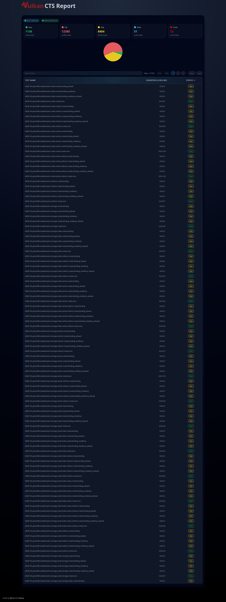

# Vulkan CTS Viewer

A small static website to better view and analyze stats from [deqp-runner](https://gitlab.freedesktop.org/mesa/deqp-runner) results. Result CSV file should be placed in [assets](https://github.com/Kbz-8/VulkanCTSViewer/tree/master/assets) folder before deploying.

## Build instructions

To build your VulkanCTSViewer follow these steps:
* Install dioxus (`cargo binstall dioxus --version 0.7.2`)
* Copy your `results.csv` to `/assets` folder
* `dx build --verbose --platform web --release`
* Publish from `./target/dx/vulkan-cts-analyzer/release/web/public`
* Enjoy

